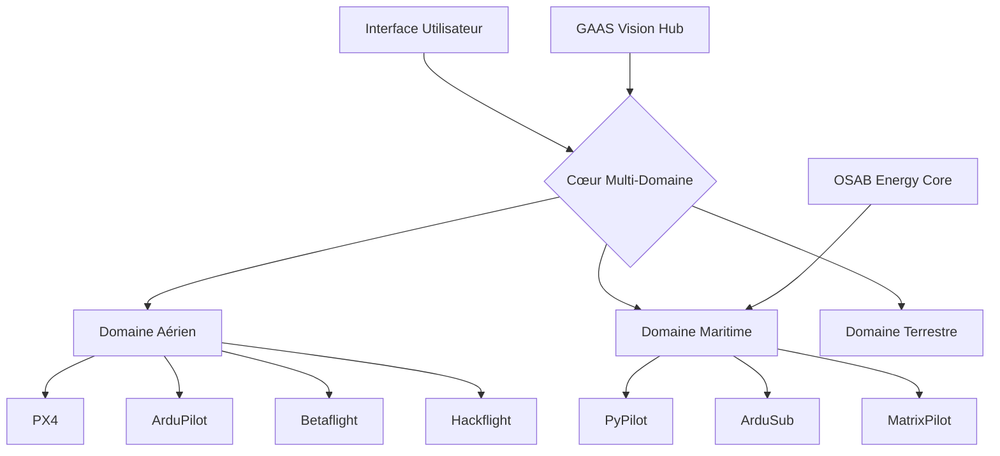

```mermaid
graph TD
    A[Interface Utilisateur] --> B{Cœur Multi-Domaine};
    B --> C[Domaine Aérien];
    B --> D[Domaine Maritime];
    B --> E[Domaine Terrestre];
    C --> F[PX4];
    C --> G[ArduPilot];
    C --> H[Betaflight];
    C --> I[Hackflight];
    D --> J[PyPilot];
    D --> K[ArduSub];
    D --> L[MatrixPilot];
    M[GAAS Vision Hub] --> B;
    N[OSAB Energy Core] --> D;
```
